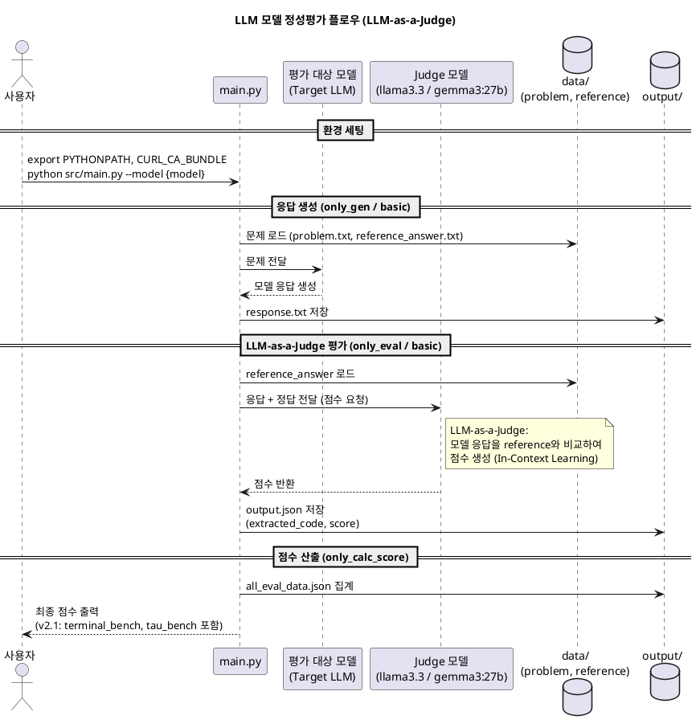

좋아. 이 페이지 **꽤 잘 잡혔어.**
특히 좋은 점은:

* `LLM-as-a-Judge` 개념 설명이 먼저 나와서 맥락이 생김
* PlantUML로 전체 흐름을 한 번에 보여줌
* 새 모델 추가 시나리오를 `Ollama / 외부 API / model_info`로 나눈 게 좋음
* 마지막에 GitHub README, 결과 템플릿으로 재귀 탐색이 이어지게 설계됨

다만 지금 상태는 **“설명 문서”로는 좋지만, plan 모드가 읽어서 요구사항 md를 뽑기엔 조금 더 구조화되면 좋다**는 느낌이야.

내가 보기엔 아래 3가지만 보강하면 훨씬 좋아져.

---

## 먼저 보강하면 좋은 점

### 1. 문서 목적을 더 명확히

지금 첫 문단은 괜찮은데,
이 페이지가 단순 소개인지, 실행 가이드 허브인지, 자동화 대상 정의인지가 살짝 섞여 있어.

그래서 초반에 딱 이렇게 박아주면 좋아:

* 이 문서는 평가 시스템의 **전체 구조 이해용**
* 세부 실행 방법은 GitHub README 참고
* 결과 업로드는 결과 기록 템플릿 참고
* 향후 자동화 skill 생성의 입력 문서로도 활용 가능

---

### 2. “자동화 관점” 섹션 추가

네 최종 목표가 단순 소개가 아니라
**이걸 plan으로 읽어서 skill까지 만들게 하는 것**이잖아.

그러면 이 페이지 안에 최소한 아래 정보가 드러나야 해:

* 사용자가 나중에 직접 넣어야 하는 값
* 문서에서 추출 가능한 값
* 자동화 가능한 절차
* 최종 산출물

이게 없으면 그냥 좋은 설명 문서로 끝날 수 있어.

---

### 3. 실행 모드 설명을 조금 더 명시

지금 PlantUML에는 `only_gen / only_eval / only_calc_score`가 있는데
본문 4번은 아직 placeholder 느낌이라, 여기에 **모드별 목적**을 넣어주면 plan이 더 잘 뽑힘.

예:

* `basic`: 생성 + Judge 평가
* `only_gen`: 응답만 생성
* `only_eval`: 기존 응답 기반 평가만 수행
* `only_calc_score`: 저장된 결과 기반 점수 재계산

---

## 내가 추천하는 페이지 구조

지금 문서를 크게 안 바꾸고, 아래처럼 조금만 더 정리하면 좋아.

---

# LLM 모델 정성평가 가이드

> 이 페이지는 `devai-llm-runner` 레포지토리 기반의 LLM 정성평가 시스템을 설명합니다.
> 평가 플로우, 새 모델 추가 방법, 평가 원리(LLM-as-a-Judge), 실행 및 결과 기록 흐름을 다룹니다.

---

## 0. 문서 목적

이 문서는 LLM 모델 정성평가 시스템의 전체 구조와 운영 방식을 이해하기 위한 가이드이다.

이 문서를 통해 다음 내용을 파악할 수 있다.

* 평가 시스템의 전체 아키텍처
* LLM-as-a-Judge 기반 평가 방식
* 새 모델 추가 시 필요한 설정 항목
* 평가 실행 모드와 주요 산출물
* 결과 기록 및 공유 흐름

세부 실행 방법은 GitHub README를 참고하고, 평가 결과 기록 형식은 Confluence 결과 템플릿을 참고한다.

---

## 1. LLM-as-a-Judge 개념

이 평가 시스템은 **LLM-as-a-Judge** 방식을 채택한다.
사람이 직접 채점하는 대신, 별도의 LLM(Judge 모델)이 평가 대상 모델의 응답을 보고 점수를 매긴다.

### 왜 LLM-as-a-Judge인가?

| 기존 방식       | LLM-as-a-Judge   |
| ----------- | ---------------- |
| 사람이 직접 채점   | Judge LLM이 자동 채점 |
| 시간·비용 많이 소요 | 빠르고 일관된 평가 가능    |
| 주관적 편차 발생   | 동일한 기준으로 반복 평가   |

### Judge 모델의 역할

Judge 모델은 아래 정보를 입력받아 점수를 생성한다.

* 평가 대상 모델의 응답 (`response.txt`)
* 정답 레퍼런스 (`reference_answer.txt`)
* 문제 (`problem.txt`)

현재 Judge 모델 예시:

* `llama3.3:latest`
* `gemma3:27b`

### 주요 신뢰성 고려사항

* **일관성**: 동일한 입력에 대해 일관된 점수를 생성하도록 프롬프트를 설계
* **편견 완화**: 위치 편견, 길이 편견 등 LLM 내재 편향 최소화
* **후처리**: 점수 추출 → 정규화 → 최종 집계 (`v2.1`: `terminal_bench`, `tau_bench` 포함)

---

## 2. 평가 플로우 다이어그램



---

## 3. 주요 구성 요소

### `main.py`

전체 평가 workflow의 진입점이다.

주요 역할:

* 입력 데이터 로드
* 평가 대상 모델 호출
* Judge 모델 호출
* 결과 저장
* 점수 집계

### 평가 대상 모델 (Target LLM)

실제로 평가받는 모델이다.

예시:

* 사내 AI 모델 endpoint
* 외부 API 모델
* Ollama로 실행 가능한 오픈소스 모델

### Judge 모델

평가 대상 모델의 응답을 reference answer와 비교하여 점수를 생성하는 모델이다.

### `data/`

입력 데이터 디렉토리이다.

예시 파일:

* `problem.txt`
* `reference_answer.txt`

### `output/`

평가 결과 저장 디렉토리이다.

예시 파일:

* `response.txt`
* `output.json`
* `all_eval_data.json`

---

## 4. 실행 모드

이 시스템은 여러 실행 모드를 지원한다.

### `basic`

응답 생성과 Judge 평가를 모두 수행하는 기본 모드이다.

### `only_gen`

평가 대상 모델의 응답 생성만 수행한다.
Judge 평가는 수행하지 않는다.

### `only_eval`

이미 생성된 응답을 기준으로 Judge 평가만 수행한다.

### `only_calc_score`

기존 평가 결과를 바탕으로 최종 점수만 다시 계산한다.

---

## 5. 새 모델 추가 시 가이드

새로운 모델을 평가하고 싶을 때 확인하거나 수정해야 하는 항목을 정리한다.

### Case A — Ollama 모델 (사내 서버에 설치 가능한 경우)

**1단계: 모델 다운로드**

```bash
ollama pull {model_name}
```

**2단계: 실행**

```bash
python src/main.py --model '{model_name}' --model_info_path {model_info_path}
```

추가 파일 수정 없이 바로 실행 가능하다.

---

### Case B — 외부 API 모델 (Ollama 사용 불가)

**1단계: `model_input/` 폴더에 새 파일 추가**

```text
model_input/
├── ollama_user_input.py
└── {new_model}_input.py
```

새 파일에는 아래 정보가 포함되어야 한다.

* `endpoint`: API 엔드포인트 URL
* `headers`: 인증 토큰 등 헤더 정보
* `body`: 요청 바디 형식

**2단계: 실행**

```bash
python src/main.py \
  --model '{MODEL_NAME}' \
  --model_input {new_model}_input.py \
  --model_info_path {model_info_path}
```

---

### Case C — `model_info.json` 업데이트 (v2.1 점수 산출 시)

v2.1 점수를 계산하려면 아래 메타데이터를 채워야 한다.

```json
{
  "name": "모델명",
  "key": "모델키",
  "release": 26.02,
  "parameter_size": "7B",
  "max_token_size": "128k",
  "terminal_bench": 43.2,
  "tau_bench": 98.2
}
```

`terminal_bench`, `tau_bench` 값은 외부 벤치마크 결과를 기반으로 입력한다.

---

### 모델 추가 체크리스트

| 항목                          | Ollama     | 외부 API     |
| --------------------------- | ---------- | ---------- |
| `ollama pull`               | ✅ 필요       | ❌          |
| `model_input/{model}.py` 생성 | ❌          | ✅ 필요       |
| `model_info.json` 업데이트      | ✅ (v2.1 시) | ✅ (v2.1 시) |
| CLI `--model_input` 옵션      | ❌          | ✅ 필요       |

---

## 6. 실행 전 환경 설정

평가 실행 전 아래 환경 설정이 필요할 수 있다.

* `PYTHONPATH`
* `CURL_CA_BUNDLE`
* 사내 인증서(`semi.crt`)
* Python 가상환경 및 패키지 설치

예시:

```bash
export PYTHONPATH={workspace}/devai-llm-runner
export CURL_CA_BUNDLE={workspace}/semi.crt
```

세부 설치 및 실행 방법은 GitHub README를 참고한다.

---

## 7. 주요 산출물

### `response.txt`

평가 대상 모델이 생성한 응답

### `output.json`

Judge 평가 결과

포함 가능 항목 예시:

* `extracted_code`
* `score`

### `all_eval_data.json`

전체 평가 결과 집계 데이터

---

## 8. 자동화 관점에서 중요한 입력값

향후 자동화 또는 skill 생성 시 아래 입력값이 중요하다.

### 사용자 입력이 필요한 값

* 평가 대상 모델 이름
* API endpoint
* 인증 token
* header 정보
* `model_info_path`
* 필요 시 `model_input` 파일명

### 문서/코드에서 추출 가능한 값

* 실행 커맨드 패턴
* 모드별 동작 방식
* 결과 파일 경로
* Judge 모델 정보
* 결과 기록 형식

---

## 9. 결과 기록 및 공유

평가 완료 후 결과는 팀 내 공유를 위해 정해진 템플릿 형식으로 정리한다.

기록 대상 예시:

* 모델명
* 릴리즈 정보
* 파라미터 수
* 최대 토큰 길이
* terminal_bench
* tau_bench
* 평가 결과 요약

결과 기록 형식과 표 구조는 별도 Confluence 결과 기록 템플릿을 따른다.

---

## 10. 관련 문서

* GitHub 레포: `devai-llm-runner` (main 브랜치)
* GitHub README 실행 가이드: `[링크 추가]`
* 평가 결과 기록 템플릿: `[링크 추가]`
* 참고 논문: [A Survey on LLM-as-a-Judge](https://arxiv.org/abs/2411.15594)

---

## 11. 향후 자동화 가능 시나리오

이 문서는 향후 아래 자동화 시나리오의 입력 문서로 활용할 수 있다.

* 사용자가 모델 endpoint와 token만 제공하면 평가 설정 자동 반영
* 평가 코드 실행 자동화
* Judge 평가 및 점수 집계 자동화
* 결과 템플릿 자동 생성
* Confluence 결과 페이지 자동 업로드

---

## 한 줄 평가

지금 네 초안은 이미 좋고,
내가 보기엔 **8번 자동화 관점**, **6번 환경 설정**, **4번 실행 모드** 이 3개만 들어가면 훨씬 “plan이 읽기 좋은 문서”가 돼.

원하면 다음엔 내가 이걸 바탕으로
**링크2(GitHub README 실행 탭)에는 어떤 내용을 넣어야 좋은지**까지 이어서 잡아줄게.
